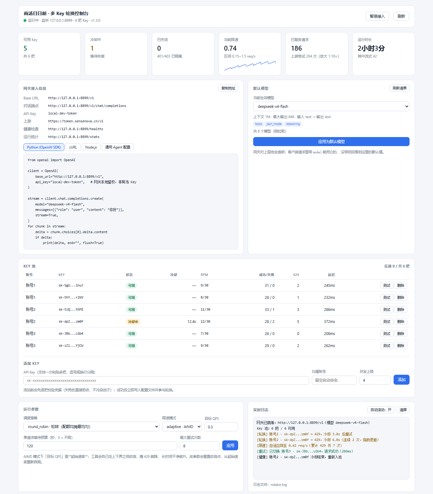

# st-rotator

**面向 OpenAI 兼容端点的多 Key 轮换 + 限流自愈网关。**

把多把 API Key 池化成一个稳定的本地端点，让上层应用在服务端限流下保持高成功率与低延迟。
适配商汤日日新（SenseNova）等 OpenAI 兼容服务，可直接接进 WorkBuddy 等上层应用。

> ⚠️ **使用前请先读 [合规与免责声明](#合规与免责声明)。**
> 本项目与任何服务商均无关联，仅供你使用**本人有权使用**的凭据。

[](https://www.python.org/)
[](#)
[](#)



---

## 它解决什么问题

大模型服务的限流策略通常是动态的、不透明的。上游一旦开始返回 429，
最直接的后果不是"慢"，而是**请求失败**和**尾延迟爆炸**。

本工具的目标是让上层应用在限流期间**保持可用**：

| 问题 | 现象 | 本工具的处理 |
|---|---|---|
| **限流口径不透明** | 429 何时出现无法预判；有的服务按**请求数**限，有的按 **token 量**限 | 主动限速（固定 / AIMD）+ **按实测窗口长度冷却**，把 429 在网关内部消化 |
| **错误分类不清晰** | 有的网关用 429 表达鉴权失败，简单的"遇 429 就重试"会在坏凭据上空转 | 解析响应体，区分"暂时限流"与"凭据失效"，分别处理 |
| **尾延迟爆炸** | 无限重试导致单个请求挂几分钟 | 单请求等待预算（`max_total_wait`），超预算立刻失败，把延迟上限钉死 |

**核心设计取向：先把限流口径测出来，再决定调哪个旋钮。**

限流参数里最容易被调错的是 QPS。如果上游实际是按 **token 量**限流的，
那么把 QPS 从 `0.3` 调到 `0.1` 对失败率**毫无改善** —— 请求频率根本不是瓶颈，
限速器降速只是在对着一个它没造成的现象做反应。真正该调的是**冷却时长**：
上游的恢复窗口有多长，冷却就该有多长。

撞到 429 时，本工具会**降低**发往上游的速率，而不是立刻换一把 Key 继续冲。
把 429 在网关内部消化掉，成功率、延迟、429 次数都能显著改善，
同时对上游更友好 —— 这既是工程上的更优解，也是更稳妥的用法。

具体的实测方法、数字和调参结论见 [限流口径实测](#限流口径实测)。

## 特性

- **零第三方依赖** —— 纯 Python 标准库实现，`clone` 完就能跑，内网 / 容器 / 离线机器都不挑
- **本地 OpenAI 兼容网关** —— 上层只看到一个稳定端点，限流、冷却、Key 轮换全部在内部消化
- **图形控制台** —— 看池子状态、加 / 删 / 体检 Key、切换模型、复制接入片段、看实时日志
- **系统托盘（Windows）** —— 图标颜色即健康度，双击开控制台，右键可操作
- **配置热更新** —— 控制台里改完立即生效并落盘，不需要重启任何东西

## 快速开始

```bash
git clone https://github.com/Phoeky/st-rotator.git
cd st-rotator
cp config.example.json config.json     # 填入你自己的 Key（config.json 已在 .gitignore 里）
```

启动（三选一）：

```bash
# 常驻系统托盘，不弹窗口 —— 推荐日常使用
python -m st_rotator tray -c config.json --port 8899

# 直接打开控制台窗口
python -m st_rotator ui -c config.json --port 8899

# 只要网关，不要界面（适合部署到服务器）
python -m st_rotator serve -c config.json --port 8080 --token <本地口令>
```

Windows 用户可以直接生成桌面快捷方式，之后双击启动：

```bash
python install_shortcut.py --desktop
```

## 接入上层应用

网关启动后，把它当成一个普通的 OpenAI 端点用：

| 配置项 | 值 |
|---|---|
| Base URL | `http://127.0.0.1:8899/v1` |
| API Key | 启动时 `--token` 指定的本地口令 |
| 模型名 | `deepseek-v4-flash`（或其他已支持的模型） |

```python
from openai import OpenAI

client = OpenAI(base_url="http://127.0.0.1:8899/v1", api_key="<本地口令>")
resp = client.chat.completions.create(
    model="deepseek-v4-flash",
    messages=[{"role": "user", "content": "你好"}],
)
```

> **对上层完全透明**：限流、冷却、Key 轮换都在网关内部消化，上层只看到一个稳定端点。
> 网关会原样透传原始 chunk，`tool_calls` / `finish_reason` / `usage` 一个字段都不改，
> 所以 Agent 的工具调用不会被吃掉。

支持的端点：

| 端点 | 说明 |
|---|---|
| `POST /v1/chat/completions` | 对话补全，支持 `stream` 与非流式 |
| `GET /v1/models` | 模型列表 |
| `POST /v1/*` | 其余端点（embeddings 等）原样透传，同样享受轮换 |
| `GET /healthz` | 健康检查（**无需 token**，可接监控探针） |
| `GET /stats` | 每把 Key 的成功 / 失败 / 429 次数、当前自适应速率 |

## 命令行

| 命令 | 作用 |
|---|---|
| `tray -c <cfg> [--port P] [--token T]` | 系统托盘 + 网关 + 控制台（推荐日常使用） |
| `ui -c <cfg> [--port P] [--token T] [--no-open]` | 图形控制台 + 网关 |
| `serve -c <cfg> [--port P] [--token T]` | 只启动网关，无界面 |
| `status -c <cfg>` | 打印 Key 池状态与限速模式 |
| `check -c <cfg>` | 逐把 Key 单独体检（区分"真失效"和"暂时无法确认"） |
| `chat -c <cfg> [-s] <prompt>` | 发一次对话，`-s` 流式 |
| `bench -c <cfg> -n N -p P` | 并发压测，验证轮换效果 |
| `demo` | 离线演示，不需要真实 Key |

## 配置

```jsonc
{
  "base_url": "https://token.sensenova.cn/v1",
  "default_model": "deepseek-v4-flash",

  "strategy": "round_robin",     // round_robin | least_inflight | least_recent | weighted
  "max_attempts": 8,             // 单个请求最多换几次 Key
  "max_total_wait": 120,         // 单请求总等待预算（秒），0 = 不限

  "rate_control": {
    "mode": "fixed",             // off | fixed | adaptive
    "qps": 0.2,                  // fixed 的目标速率；adaptive 的初始速率
    "min_qps": 0.15,
    "max_qps": 1.5,
    "decrease": 0.85,            // 撞 429 时的乘性衰减系数（仅 adaptive）
    "increase_step": 0.05,
    "recovery_seconds": 8        // 距离上次 429 多久才允许提速（仅 adaptive）
  },

  "cooldown": {
    "base": 60,                  // ★ 首次冷却秒数，应 ≈ 上游的限流恢复窗口
    "factor": 1.5,
    "max": 120,
    "jitter": 0.5,
    "invalid_ttl": 600,          // 失效 Key 多久后允许再探一次
    "server_error": 2
  },

  "accounts": [
    {
      "name": "账号1",
      "api_keys": ["${SENSENOVA_KEY_1}"],   // 支持 ${ENV} 占位符
      "rpm_limit": 2,                       // ★ 该账号每分钟最多几次，按实测额度填
      "max_concurrency": 4,
      "weight": 1
    }
  ]
}
```

**同一账号下的多把 Key 共享账号配额**，所以 `rpm_limit` 建议填「账号总配额 ÷ Key 数量」。

> ⚠️ **`cooldown.base` 是最容易调错、也最该调的一个参数 —— 它应该 ≈ 上游的限流恢复窗口。**
> 填小了会让一把已经撞墙的 Key 在几秒后被反复重试，全是白打的请求，
> 实测能把重试放大 **3 倍以上**，成功率反而更低（详见 [限流口径实测](#限流口径实测)）。

> ⚠️ **`rpm_limit` 填太大等于这个闸门不存在。** 如果你填 `30` 而上游真实额度只有 `2`，
> 那么池子永远不会拦，只会把 429 留给上游去回。按实测额度填。

> ⚠️ 用 `adaptive` 模式时**不要改小 `decrease`、也不要把 `recovery_seconds` 调大。**
> `0.85` / `8` 是实测调出来的：改成 `0.6` / `20` 会让速率触底爬不回来，吞吐掉到原来的三分之一。
> 但如果上游是按 token 量限流，AIMD 控制的就是错的变量 —— 这种情况请改用 `fixed`。

### 配额估算

> **前提：只用你本人有权使用的凭据。**
> 请勿把他人账号的 Key 放进池子，也不要通过批量注册账号放大免费额度 ——
> 那既违反绝大多数服务商的条款，也不是本工具的设计用途。

**先测口径，再算产能。** 很多 OpenAI 兼容端点（包括商汤日日新）的实际限制是
**每分钟 output tokens（TPM）**，而不是每分钟请求数（RPM）。
这种情况下产能与「单次输出多大」直接挂钩：

```
可持续 req/s = 账号数 × 单账号额度(tokens/min) ÷ 单次输出(tokens) ÷ 60
```

实测商汤日日新的单账号额度约 **1000~2000 output tokens/分钟**，按 1500 估算，
6 把 Key 的产能随单次输出大小的变化：

| 单次输出 | 可持续速率 | 典型场景 |
|---|---|---|
| 300 tokens | 0.50 req/s | 短问答、分类、信息抽取 |
| 500 tokens | 0.30 req/s | 短代码片段、摘要 |
| 750 tokens | 0.20 req/s | 中等 HTML 片段 |
| 1000 tokens | 0.15 req/s | 整页 HTML / 长文 |
| 2500 tokens | 0.06 req/s | 大文件生成 |

> **降输出比加 Key 更划算。** 让上层 agent 输出 diff/patch 而不是整个文件，
> 产能立刻翻几倍，而且不增加凭据数量。

在合规使用自有凭据的前提下，按下面的方式估算所需 Key 数：

```
所需 Key 数 ≈ 峰值请求数/分钟 ÷ 单把 Key 的实测可用速率 × 1.5（安全余量）
```

| 场景 | 峰值调用量 | 建议 Key 数 |
|---|---|---|
| 个人轻量 | ~2 req/min | 2 把 |
| 单人 Agent | ~5 req/min | 3~4 把 |
| 3~5 人小团队 | ~15 req/min | 8~10 把 |
| 20 人团队 | ~60 req/min | 25~30 把 |

> 上表按「单次输出 ≤500 tokens」估算。接 Agent 类应用要按工具调用循环估：
> 一个用户回合可能触发 5~20 次模型调用，远高于聊天场景。
> 如果单次输出动辄上千 tokens，请用上面的公式重新算 —— Key 数要多得多。

**如果加了 Key 吞吐仍然上不去**，先按 [限流口径实测](#限流口径实测) 的方法测一遍口径：
瓶颈可能不在凭据数量，而在上游按账号独立的 token 额度。这种情况下
**降低单次输出或错峰使用**比继续加 Key 有效。

## 限流口径实测

> 这一节是**方法 + 实测数字**。换一个上游时照这个流程重测一遍，比凭感觉调参有效得多。

### 为什么不能靠猜

判断"该不该调 QPS"，只需要一个数：**你实际发往上游的请求速率**。

```
实际上游尝试速率 = upstream_attempts ÷ uptime_seconds     # 见 GET /stats
```

把它和限速器的设定值比。如果实测值**远低于**设定值，说明**限速器从未成为瓶颈** ——
它每次降速都是在对一个它没造成的现象做反应。此时调 QPS 不会改善任何指标。

### 四步探测法

**第 0 步 · 先看有没有现成答案**

```bash
curl -si -H "Authorization: Bearer $KEY" https://<host>/v1/models | head -30
```

找 `x-ratelimit-*` / `retry-after` 响应头，有就直接读。很多网关什么都不返回
（商汤只返回 `X-Request-Id`），那就只能行为探测。同时把 429 的**响应体原文**打出来 ——
措辞本身就是线索（`tpm/rpm limit` 还是 `insufficient_quota`）。

**第 1 步 · 排除 RPM / RPS**

同一批 Key 各发 1 次极小请求（`max_tokens=8`），**零间隔**。

- 全 200 → RPM/RPS 不是瓶颈，别再调 QPS
- 出现 429 → 按请求数限流，去看 `retry_after`

**第 2 步 · 定位 TPM**

先让一个账号生成一大段文本，**紧接着零间隔**用其余账号各发一次极小请求。

- 其余账号大量 429 → 额度**共享**（同账号多 Key / 同 IP 级限流）
- 其余账号基本正常 → 额度**按账号独立**

**第 3 步 · 单账号自证 + 测恢复窗口（最关键的一组）**

只用一个账号，按顺序执行，记录每一步的状态码：

```
2 次极小请求            → 基线
1 次大生成（如 2000 tokens）
紧接着 3 次极小请求      → 看第几次 429
等 65 秒
再 3 次极小请求          → 看是否完全恢复
```

大生成后立刻 429、65 秒后全恢复 → **确认是 TPM + 60 秒滚动窗口**。
65 秒后仍 429 → 不是分钟级窗口，可能是日配额耗尽，得换思路。

**第 4 步 · 量化单账号容量**

同一账号**零间隔**连发「业务真实大小」的请求，打到第一次 429 为止，
累计 `usage.completion_tokens`。**这个累计值就是单账号额度**，代入上面的产能公式。

### 实测结果（商汤日日新，2026-09-15）

| 实验 | 做法 | 结果 |
|---|---|---|
| 排除 RPM | 6 把 Key 零间隔各发 1 次极小请求 | **6/6 全 200**（0.6 req/s 突发） |
| 跨账号影响 | 账号1 生成 2500 tokens 后打其余 5 把 | 4/5 成功 → 额度**按账号独立** |
| 单账号自证 | 大生成 → 连发 3 次 → 等 65s → 再连发 3 次 | 200,**429,429** → 65s 后 **200,200,200** |
| 量化容量 | 账号6 连发千 token 级请求 | 第 1 次成功，**第 2 次立刻 429** |

**结论**

- 限制是 **TPM（每分钟 output tokens）**，不是 RPM
- 单账号额度 **≈1000~2000 tokens/分钟**，且**各账号不一致**（实测 1000 vs 2024）
- 撞墙后 **60 秒完全恢复**
- 429 响应体统一为 `{"error":{"message":"inference exceeds tpm/rpm limit",...}}`
- 上游**不返回任何限流响应头**，只能行为探测

### 调参结论

| 参数 | 怎么定 | 为什么 |
|---|---|---|
| `cooldown.base` | **≈ 上游恢复窗口**（商汤 = 60s） | 填 3s 会让撞墙的 Key 在几秒后被反复重试，白打 5 次才停满窗口 |
| `rpm_limit` | **单账号额度 ÷ 单次输出** | 填 30 而真实额度是 2，这个闸门等于不存在 |
| `rate_control.qps` | 按产能公式算 | 别拍脑袋 |
| `rate_control.mode` | 上游按 TPM 限流时用 `fixed` | AIMD 调的是 QPS 而瓶颈是 token 量，控制变量错了 |
| 单次输出大小 | **尽量小** | 产能与输出 token 数成反比，这是最大的杠杆 |

> 按这套参数（商汤 6 把 Key）：重试放大**预期**从 3.25× 降到接近 1×，
> 那些白打的 429 不再发生，客户端等待时间大幅下降。
> 注意这**不提升峰值吞吐** —— 峰值由上游额度决定，任何客户端参数都突破不了。

## 注意事项

- **默认只监听 `127.0.0.1`。** 改成 `0.0.0.0` 等于同网段任何人都能用你的凭据，
  同时也会构成"许可他人使用"，可能违反你所使用的服务条款。
- **永远设 `--token`。** 不设口令等于本机任何进程都能白嫖。
- `config.json` 含明文密钥，已加入 `.gitignore`，**不要提交**。推荐用 `${ENV}` 占位符写法。
- 日志里的 Key 一律脱敏（`sk-J79...aZuN`），可以安全外发。
- **控制台页面会明文显示 token**（复制接入片段需要），截图外发前注意避开。
- `deepseek-v4-flash` 是推理模型，`reasoning_content` 与 `content` 共用 `max_tokens` 预算，
  **建议不低于 500**，否则 `content` 会返回空串。

## 合规与免责声明

### 凭据使用

- **只使用你本人有权使用的凭据。** 请勿把他人的 API Key 放进池子 ——
  多数服务条款都明确禁止账号借用、出租、转让或以其他方式许可他人使用。
- **不要通过批量注册账号来放大免费额度。** 这不属于本工具的设计用途。
- **不要把网关暴露给他人。** 默认只监听 `127.0.0.1`；对外提供接入等同于把你的凭据
  许可给他人使用。
- 你对自己如何使用本工具负全部责任，包括遵守你所使用服务的服务条款与当地法律法规。

### 免责

- 本项目是**独立的第三方开源工具**，与商汤科技及任何其他服务商
  **没有任何隶属、合作、赞助或背书关系**。
- 项目名称及文档中出现的服务名、模型名，仅为**说明兼容性**而作的描述性引用，
  相关商标归其各自权利人所有。
- 本工具**不破解、不绕过任何服务商的技术措施**，也不提供任何凭据。
  它只在你提供的凭据之上做客户端侧的**重试、限速与容错**。
- 软件按 MIT 协议「原样」提供，不附带任何明示或默示担保。作者不对使用本工具产生的
  任何后果负责，包括但不限于账号被限制或终止、服务中断、数据或业务损失。
- 商业场景使用前，请自行咨询法律意见。

## 项目结构

```
st_rotator/
├── keypool.py      # ★ 核心：Key 池调度、冷却、RPM 窗口、统计
├── client.py       # ★ 核心：错误分类、轮换重试、流式/原始 chunk 透传
├── proxy.py        # ★ 本地 OpenAI 兼容网关
├── ui.py           # ★ 控制台后端：状态快照、写操作、路由
├── tray.py         # ★ Windows 托盘（纯 ctypes 调 Shell_NotifyIcon）
├── trayicons.py    # 状态图标生成（手工拼 ICO 字节，不需要 Pillow）
├── dashboard.py    # 控制台前端（单文件 HTML，零 CDN 依赖）
├── transport.py    # 零依赖 HTTP 客户端（连接池 + 流式读取）
├── limiter.py      # 固定限速 + AIMD 自适应限速
├── config.py       # 配置加载、校验、${ENV} 展开、定点落盘
├── logs.py         # 日志环形缓冲 + 文件轮转
├── cli.py          # 命令行
└── demo.py         # 内置模拟上游
```

## 环境要求

- Python **3.10+**（用到了 `X | Y` 类型语法）
- 无任何第三方依赖，无需 `pip install`

## License

MIT
